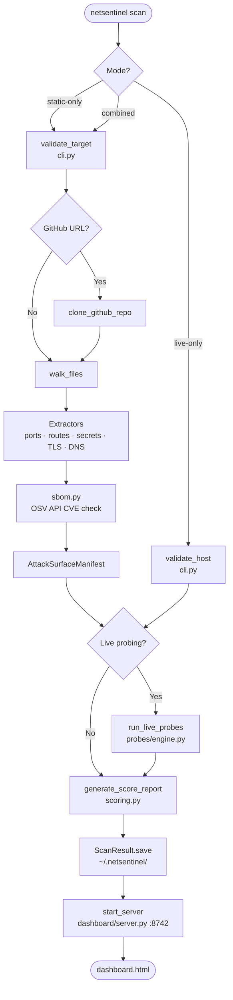
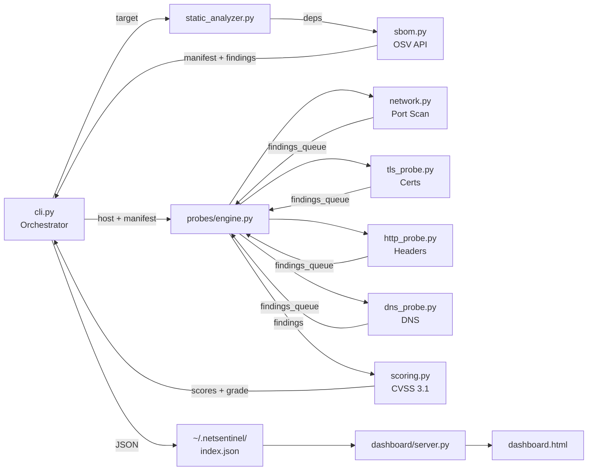
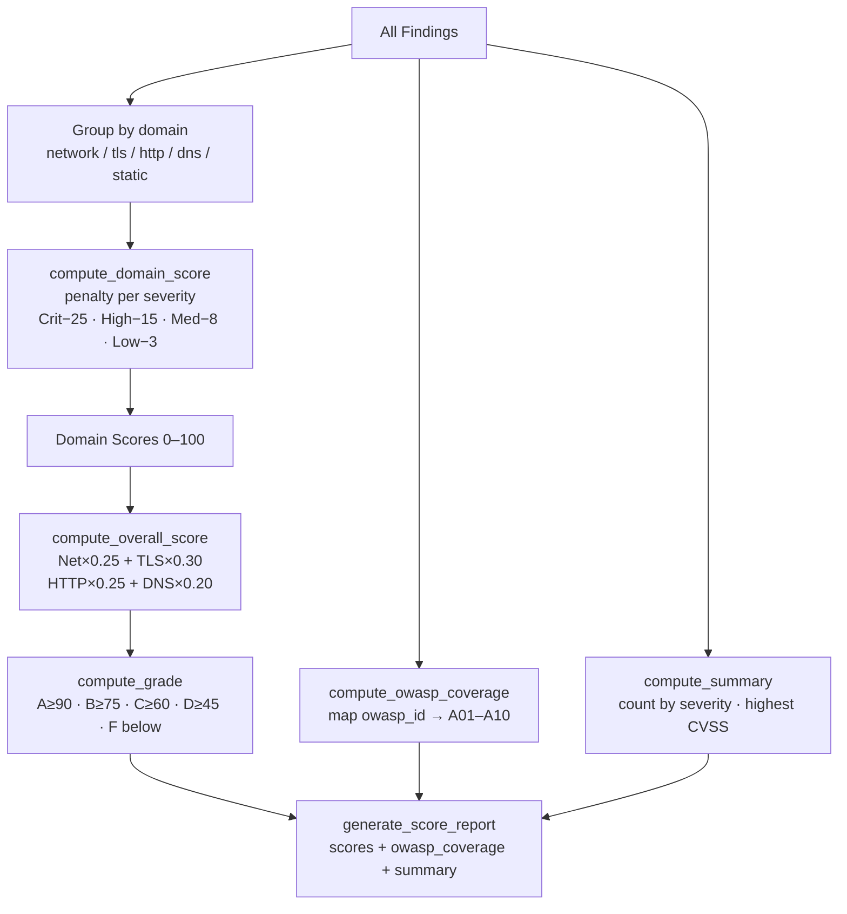
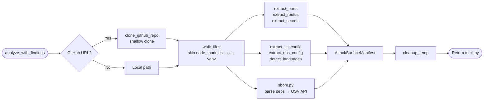

# NetSentinel — Lab Manual

---

## Aim

NetSentinel is a network security auditing tool that combines **static attack-surface extraction** from source code with **live multi-layer network probing** to deliver a complete, scored security assessment in a single command. It solves the problem of blind-spot audits by correlating what the codebase *declares* (ports, routes, secrets, TLS configuration, dependencies) against what a live host actually *exposes* at runtime. The tool is built for **security engineers, developers, and penetration testers** who need CVSS 3.1-scored, OWASP Top 10 2021-mapped findings presented in an interactive browser dashboard — without manually chaining separate tools together.

---

## Objectives

### 1. Unified Static and Live Security Analysis

- **What it achieves:** NetSentinel merges two traditionally separate disciplines — Static Application Security Testing (SAST) and live network probing — into a single, coherent pipeline.
- **How it works technically:** `static_analyzer.py` performs read-only file traversal over Python, TypeScript, Java, Go, Ruby, and PHP codebases to extract declared ports, HTTP routes, hardcoded secrets, TLS settings, DNS configuration, and a Software Bill of Materials (SBOM). `probes/engine.py` then orchestrates concurrent live probes against the actual running host, and `_detect_undeclared_ports()` cross-checks discovered open ports against those declared in the manifest.
- **Why it matters:** Runtime behaviour often diverges from what the code declares. Surfacing that gap automatically eliminates a class of misconfiguration findings that neither pure SAST nor pure network scanning would catch alone.

---

### 2. Concurrent Four-Domain Live Probing

- **What it achieves:** Full-stack network reconnaissance across the Transport, TLS/SSL, HTTP Application, and DNS layers in a single scan run.
- **How it works technically:** `probes/engine.py` spawns four daemon threads simultaneously. `network.py` uses `asyncio` with 500 concurrent sockets to sweep the top-1000 TCP ports plus any ports found in the static manifest; it also performs ICMP probing with TTL-based OS fingerprinting and banner grabbing. `tls_probe.py` inspects certificate validity, cipher suites, and protocol versions. `http_probe.py` checks security headers, CORS policy, and sensitive path enumeration. `dns_probe.py` uses `asyncio` to test zone transfers, SPF/DMARC/DKIM records, subdomain brute-force, and open-resolver detection.
- **Why it matters:** Most standalone tools cover only one layer. By running all four concurrently and collecting results via a thread-safe `queue.Queue`, NetSentinel minimises wall-time while providing cross-layer context for each finding.

---

### 3. Standards-Based CVSS 3.1 Scoring and OWASP Mapping

- **What it achieves:** Every finding is assigned a numeric severity score and mapped to a recognised compliance framework category, making reports directly actionable for remediation prioritisation and audit reporting.
- **How it works technically:** `scoring.py` implements the full CVSS 3.1 base-score formula — computing Impact Sub-Score, scope-adjusted Impact, and Exploitability sub-scores from vector components stored in `config.py`. `generate_score_report()` computes per-domain scores (Network × 0.25, TLS × 0.30, HTTP × 0.25, DNS × 0.20) and a weighted overall grade (A–F). `compute_owasp_coverage()` maps each finding's `owasp_id` field across all ten OWASP Top 10 2021 categories.
- **Why it matters:** Raw finding lists are not actionable without risk context. CVSS scoring and OWASP mapping turn the output into compliance-ready evidence suitable for management reports and bug-tracker triage.

---

### 4. Dependency Vulnerability Enrichment via SBOM

- **What it achieves:** Supply-chain risk is surfaced alongside network findings by checking every declared dependency against a live CVE database.
- **How it works technically:** `sbom.py` parses `package.json`, `requirements.txt`, and `pyproject.toml` files found during `walk_files()`. It then batches dependency name and version pairs to the **OSV API** (`api.osv.dev/v1/querybatch`) and converts matched vulnerabilities into `Finding` objects with `domain="static"`, complete CVSS scores, and remediation guidance. The resulting `DependencyEntry` records are attached to the `AttackSurfaceManifest` returned to `cli.py`.
- **Why it matters:** The majority of modern application vulnerabilities originate in third-party libraries, not first-party code. Including SBOM findings in the same scored report as network findings prevents supply-chain risk from being overlooked.

---

### 5. Persistent Scan History and Interactive Dashboard

- **What it achieves:** All scan results are preserved across sessions and presented in a filterable, comparable browser UI — turning NetSentinel from a one-shot CLI into an ongoing security monitoring instrument.
- **How it works technically:** `cli.py` serialises each completed scan as a JSON file to `~/.netsentinel/scans/<scan-id>.json` and maintains a master `index.json`. `dashboard/server.py` exposes `/api/scans` and `/api/scans/<id>` REST endpoints backed by those files, and serves the zero-dependency `dashboard.html` single-page application on port 8742. The UI supports filtering by severity, domain, and OWASP category, and side-by-side comparison via the `netsentinel compare` command.
- **Why it matters:** Security posture changes over time. Persistent history with comparison views enables teams to measure whether remediation efforts between audit cycles are reducing risk, and to detect regressions introduced by new deployments.

---

## Diagrams

### Diagram 1 — End-to-End Execution Flowchart

---

### Diagram 2 — System Block Diagram

---

### Diagram 3 — Scoring Engine Flow

---

### Diagram 4 — Static Analyzer Pipeline

---

## Application & Conclusion

### Real-World Applications

- **CI/CD Security Gates:** NetSentinel can be integrated as a pipeline step that runs on every pull request, using `--static-only` mode to diff the attack surface introduced by new code — flagging newly exposed ports, hardcoded secrets, or vulnerable dependency versions before they reach a staging environment.

- **Pre-Deployment Infrastructure Audits:** Operations and DevSecOps teams can run a combined static + live scan against a staging host before promoting to production. The cross-check in `_detect_undeclared_ports()` immediately surfaces infrastructure-as-code drift, where a container exposes a port at runtime that no Dockerfile or compose file declares.

- **Penetration Testing Engagements:** The single-command CVSS-scored, OWASP-mapped report replaces the manual assembly of Nmap, SSLyze, and dependency scanners, allowing testers to spend time on exploitation and validation rather than tool orchestration. The persistent scan history and `compare` command support before/after remediation evidence collection.

- **Developer Security Education:** The interactive `dashboard.html` UI makes findings and their remediation guidance accessible to developers without a security background — bridging the gap between a vulnerability report and actionable code change, particularly through the OWASP Top 10 category labels that contextualise every finding.

### Conclusion

NetSentinel demonstrates a technically sound fusion of SAST, SBOM enrichment, and concurrent multi-protocol live probing under a single CVSS 3.1-aligned scoring framework — a combination that no single existing open-source tool provides in one workflow. Current limitations include no support for authenticated scanning, active exploitation, or IPv6 hosts, and DNS probing is automatically skipped when the target is a bare IP address. Future scope visible directly in the codebase includes extended language support (Ruby, PHP, and Rust dependency parsing are already enumerated in `static_analyzer.py` and `sbom.py`), richer dashboard comparison views flagged as the "demo showpiece" in the README, and git-history secret scanning via the fully implemented but not yet wired `scan_git_history_for_secrets()` function in `static_analyzer.py`.

---

*Powered by Python 3.10+ · asyncio · threading · CVSS 3.1 · OWASP Top 10 2021 · OSV API*
