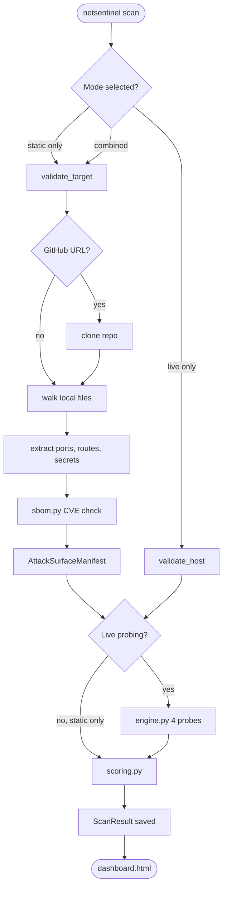
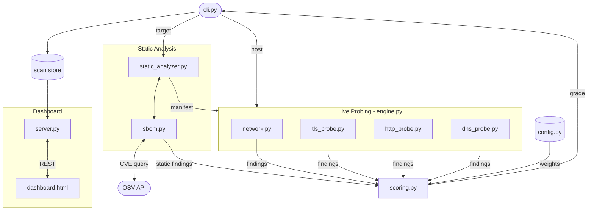
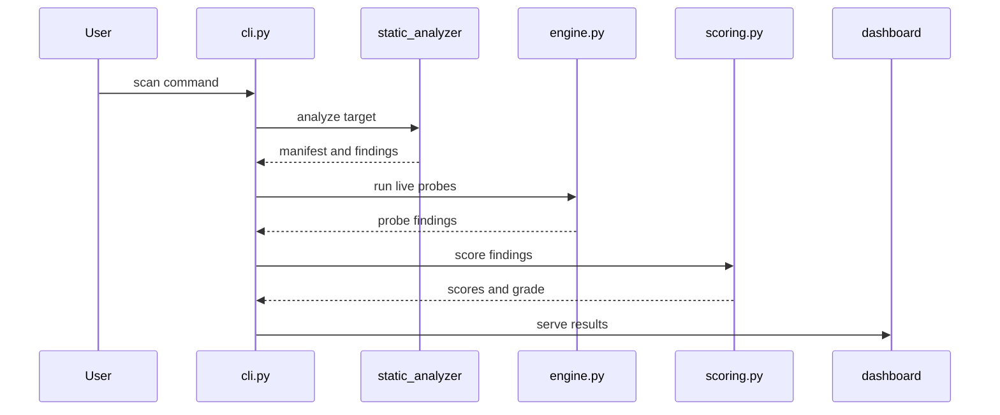

# NetSentinel — Lab Manual

---

## Aim

NetSentinel is a security auditing tool that scans both a codebase and a live host, then scores every issue it finds. The problem it fixes is simple — most teams use four or five separate tools to cover ports, TLS, HTTP headers, DNS, and dependencies, and nothing ties the results together. NetSentinel replaces that stack with one command that reads your code, probes your host, and opens a scored dashboard automatically.

---

## Objectives

- **Static attack surface extraction.** `static_analyzer.py` reads every source file without executing any code. It pulls out port numbers, API routes, hardcoded secrets, TLS flags, and DNS config, and packages everything into an `AttackSurfaceManifest`. That manifest is passed straight to the live probe layer so the two phases share context.

- **Concurrent four-domain probing.** `probes/engine.py` runs four threads at the same time. `network.py` scans up to 1000 TCP ports using asyncio with 500 concurrent sockets. `tls_probe.py` checks certificate validity and cipher suites, `http_probe.py` tests security headers and sensitive paths, and `dns_probe.py` checks SPF, DMARC, and zone transfers.

- **CVSS 3.1 scoring with OWASP mapping.** `scoring.py` applies the full CVSS 3.1 base-score formula to every finding. Domain scores are weighted — TLS carries the most at 30%, network and HTTP at 25% each, DNS at 20% — and combined into a single A–F grade. Every finding also gets tagged with one of the ten OWASP Top 10 2021 categories.

- **Dependency CVE checking via SBOM.** `sbom.py` parses `package.json`, `requirements.txt`, and `pyproject.toml` to build a dependency list. It queries the OSV API in batches and converts any matched CVE into a `Finding` object with the same CVSS scoring as network issues. Vulnerable packages show up in the same dashboard as port and header findings.

- **Persistent scan history and dashboard.** Every scan is saved to `~/.netsentinel/scans/` as JSON and indexed in `index.json`. `dashboard/server.py` starts a local server on port 8742 and serves `dashboard.html`. Results from multiple scans persist so you can filter by severity or OWASP category and compare two runs side by side.

---

## Flowchart — Execution Pipeline

---

## Architecture Diagram — System Design

---

## Sequence Diagram — Component Interaction

---

## MVP — What This Proposes

Most security tools are either static-only (Snyk, Semgrep) or live-only (Nmap, SSLyze). None of them cross-reference the two. NetSentinel's core proposal is that the most dangerous findings come from the *gap* between what your code says it does and what your server actually does at runtime.

- **Manifest-informed live probing.** Before any port is scanned, `static_analyzer.py` extracts every port the codebase declares. `engine.py` uses that manifest to prioritise its scan — instead of blindly sweeping ports, it already knows which ones matter. This is new behaviour that no general-purpose port scanner offers.

- **Undeclared port detection.** `_detect_undeclared_ports()` in `engine.py` cross-checks every open port found at runtime against the manifest. If port 6379 (Redis) is open but no source file ever declares it, that surfaces as a dedicated finding. Standard scanners report open ports; this reports open ports *that should not exist*.

- **Uniform CVSS scoring across all finding types.** Network, TLS, HTTP, DNS, and dependency findings all go through the same `scoring.py` pipeline with the same CVSS 3.1 formula. That makes a misconfigured cipher suite directly comparable to a vulnerable npm package — both get a numeric score, a severity tag, and an OWASP category. No other open-source tool does this across all five domains in one run.

- **Zero-dependency persistent dashboard.** `dashboard.html` is a single HTML file with no CDN calls and no build step. Scan history accumulates in `~/.netsentinel/` across runs so you can track security posture over time and compare any two scans side by side — a feature missing from nearly every CLI security tool.

---

## Application & Conclusion

### Applications

- **Pull request checks** — run in `--static-only` mode on every PR to catch new secrets, exposed ports, or vulnerable packages before they reach staging.
- **Pre-deploy audits** — scan a staging host before promoting to production and catch any port the container opens that no Dockerfile declares.
- **Penetration testing** — get a CVSS-scored, OWASP-mapped report in one pass instead of stitching together multiple tools by hand.
- **Security training** — the dashboard makes findings readable to developers with OWASP labels and remediation notes on every issue, without needing a security background to interpret them.

### Conclusion

NetSentinel works because it ties static code reading, live probing, SBOM checking, and CVSS scoring into one pipeline rather than treating them as separate problems. The main limitation is that it only covers unauthenticated scanning — it cannot probe behind a login or handle IPv6 targets. The most obvious extension already in the codebase is `scan_git_history_for_secrets()` in `static_analyzer.py`, which is fully written but not yet wired into the main scan flow.

---

*Python 3.10 · asyncio · CVSS 3.1 · OWASP Top 10 2021 · OSV API*
